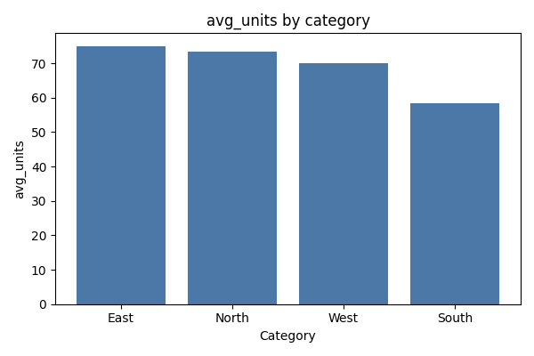

# My-first-agent-program

## MVP Analyst Agent

This repository contains a minimal analyst agent that:
- Loads a CSV into DuckDB using a safe SQL tool.
- Builds a simple analysis plan.
- Runs a single SELECT query, saves results, and generates a chart via safe chart helpers.
- Writes a Markdown report to `reports/latest.md`.
- Emits structured JSONL tracing.
- Includes a lightweight eval harness.

### Setup

Install dependencies:

```bash
pip install -r requirements.txt
```

### Run the MVP

```bash
python -m analyst_agent run --question "Which region has the highest average units?" --data data/sample.csv
```

This writes:
- `reports/latest.md`
- `reports/trace.jsonl`
- `artifacts/tables/query_*.csv`
- `artifacts/charts/chart_*.png`

### Example Output

Example chart generated from the sample dataset (avg_units by category).


### Run the eval harness

```bash
python -m analyst_agent eval --data data/sample.csv
```

Reports and traces will be written under `reports/evals`.

## Tooling & safety

The agent uses a minimal tool layer to keep execution safe and deterministic:

- `SQLTool` loads the CSV into DuckDB and only permits single-statement `SELECT` queries.
  - Queries containing `CREATE`, `INSERT`, `UPDATE`, `DELETE`, `DROP`, `ALTER`, `COPY`,
    `ATTACH`, `DETACH`, or `PRAGMA` are rejected.
  - Semicolon-separated multi-statements are rejected.
  - Result sets are capped at 200 rows by default; missing `LIMIT` clauses are appended,
    and larger limits are clamped.
  - Each result table is saved to `artifacts/tables/query_<id>.csv`, and a preview
    (first 20 rows) is included in the report.
- `PythonChartTool` generates charts from dataframes without arbitrary code execution.
  - Bar charts are used for categorical aggregations; line charts are used when a date
    column is detected.
  - Charts are saved to `artifacts/charts/chart_<id>.png` with deterministic IDs.

Tracing is written to `reports/trace.jsonl` with structured JSONL entries describing
plan steps, tool calls, outputs, and errors.
